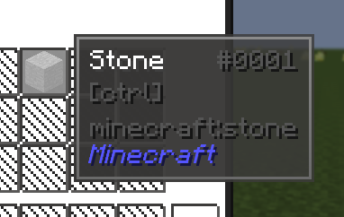

---
navigation:
  title: Chromatic Tooltips
  parent: other.md
categories:
    - Notes and additional configuration
---
# Chromatic Tooltips
If you don't like the styling of the pack's tooltips, you can disable it in the ChromaticTooltip's configuration file.

Config path: ==\config\chromatictooltips.cfg #enabledResourcePackThemes== *(set to false)* (or in-game config menu)

