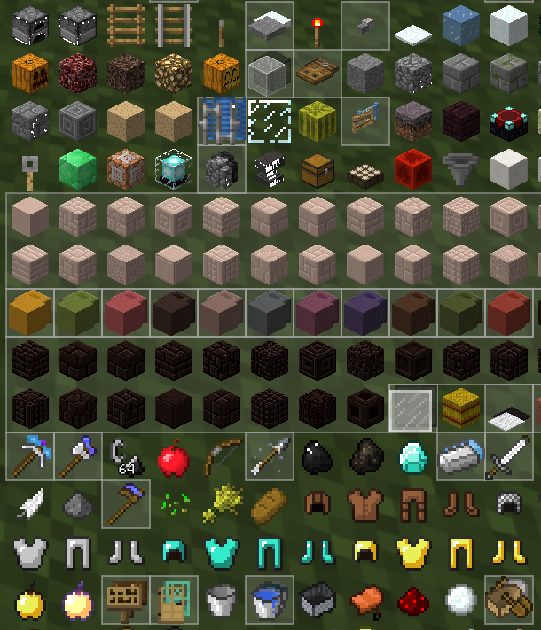

---
navigation:
  title: NEI collapsible items
  parent: other.md
categories:
    - Notes and additional configuration
---
# NEI collapsible items
You can change the NEI config for the collapsible items to match the ShadowUI theme.

Config path: ==\config\nei\client.cfg #collapsibleItems== (or in-game config menu)
- ==collapsedColor=0x33AAAAAA==
- ==expandedColor=0x20AAAAAA==

