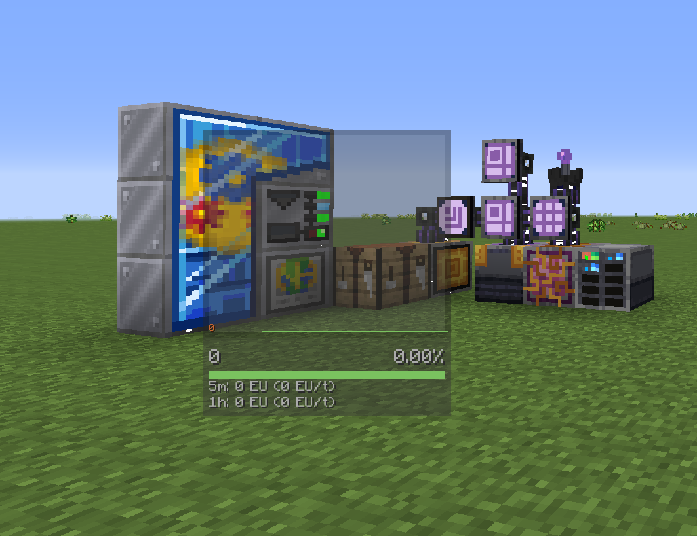
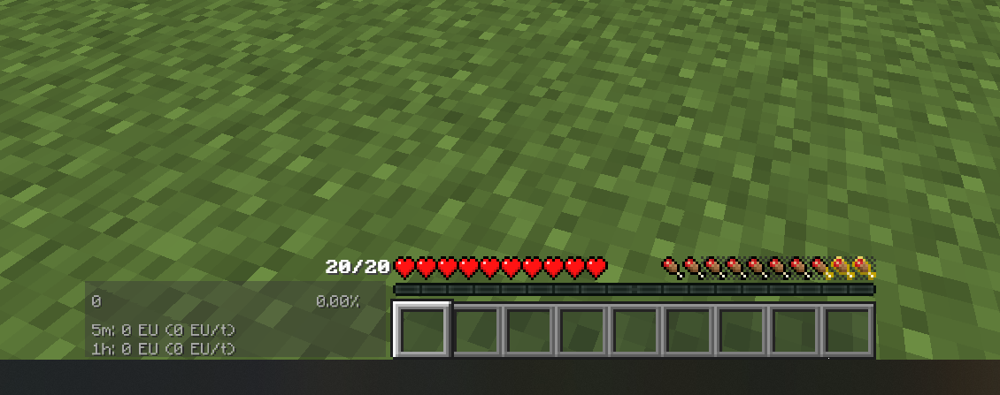

---
navigation:
  title: Power Goggles
  parent: other.md
categories:
    - Notes and additional configuration
---
# Power Goggles
You can change the styling of the Power Goggles to match the ShadowUI theme.

Config path: ==\config\gregtech\goggles.cfg== (or in-game config menu)
- ==I:"Bad Gradient"=-5161389==
- ==I:"Bad Text"=-5161389==
- ==I:"Chart Background Color"=1883916616==
- ==I:"Chart Border Color"=1881416483==
- ==I:"Chart Manual Scale Indicator Color"=-11696==
- ==I:"Chart Max Text Color"=-3905998==
- ==I:"Chart Min Text Color"=-3905998==

- ==I:"Good Gradient"=-13487361==
- ==I:"Good Text"=-8732065==

- ==I:"Measurements Background Color"=1882732343==
- ==I:"Ok Gradient"=-8732065==
- ==I:"Ok Text"=-5592406==

